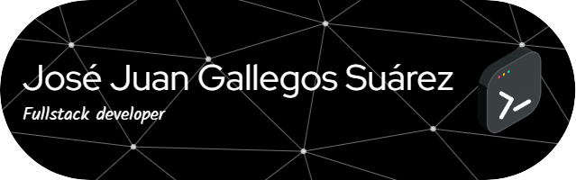

    

## **Egresado de la carrera de Ingeniería en Sistemas Computacionales de Universidad CUGS en 2024**

Poseo una base en desarrollo web, con experiencia en tecnologías front-end como **JavaScript (React, Angular), HTML, CSS 
(incluyendo TailwindCSS)** y  back-end como **PHP y Python**.  He trabajado con bases de datos relacionales como **MySQL y PostgreSQL**, 
así como con la base de datos no relacional **MongoDB**.

Si bien mi experiencia con APIs RESTful es limitada, estoy familiarizado con el desarrollo web back-end y  entusiasmado por aprender 
nuevas tecnologías.

Cuento con experiencia en el diseño de interfaces de usuario (UI) y experiencia de usuario (UX), utilizando herramientas como Figma.

Además, estoy familiarizado con herramientas de desarrollo como **Git y Docker**, y metodologías ágiles como **Scrum y Kanban**.

## **Experiencia en el desarrollo de una página web para el alta de avalúos:**

Durante mi servicio social, participé en el desarrollo de una página web para el registro de avalúos.  En este proyecto, colaboré con otros 
programadores en un equipo multidisciplinario que incluía al área encargada de proporcionar la documentación para el diseño y 
desarrollo del sistema.  Utilizamos HTML, PHP, CSS y SQL Server para construir la aplicación.

## **Entrega puntual de proyectos:**

Para asegurar la entrega puntual de proyectos, realizo una estimación del tiempo requerido y  agrego un margen de seguridad para imprevistos. Además, elaboro un cronograma detallado para guiar el proceso de desarrollo.

<!-- 

    

 -->

## Competencias
<table><tr><td valign="top" width="33%">

### Frontend  

  

                <!--    --><!--    -->

  

</td><td valign="top" width="33%">

### Backend  

  

          <!--    -->           <!--    -->   

</td><td valign="top" width="33%">

### DevOps  

  

    <!--    --><!--    -->         <!--    -->        

</td></tr></table>  

### Otras Habilidades

 

 

      

<!-- --> 
   

### Redes Sociales

<a href="https://www.linkedin.com/in/jose-juan-gallegos" target="_blank" rel="noreferrer"> <picture> <source media="(prefers-color-scheme: dark)" srcset="https://raw.githubusercontent.com/danielcranney/readme-generator/main/public/icons/socials/linkedin-dark.svg" /> <source media="(prefers-color-scheme: light)" srcset="https://raw.githubusercontent.com/danielcranney/readme-generator/main/public/icons/socials/linkedin.svg" />  </picture> </a>

